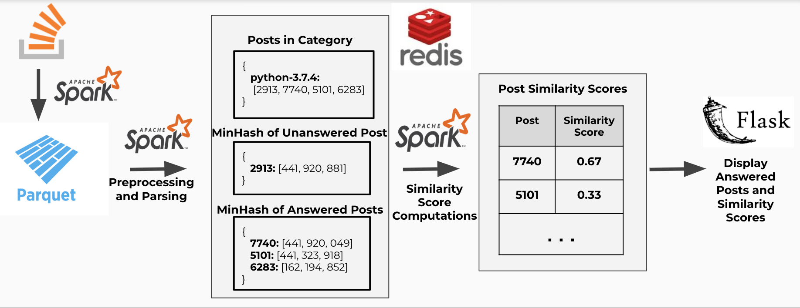

# ReduceFlow
Website: dataignition.tech
---
### Overview
A lot of times we stumble across an unanswered question on StackOverflow, only to tweak the search keywords to find a similar question that's already been answered. For my project, I wanted to improve the StackOverflow user experience by recommending similar answered posts whenever a user lands on an unanswered one.

However, text similarity at scale is a challenge and the pipeline that I built ingests bodies of text and determines which ones are similar or identical. The pipeline utilizes Spark, Redis, text comparison limited to posts in each category, and the MinHash text comparison algorithm to scale up more effectively in terms of computation and storage.

### Pipeline Architecture

The pipeline involves taking in StackOverflow posts (https://archive.org/download/stackexchange) and converting the unstructured XML files into parquet files. It then does some preprocessing to generate two things:
- A mapping of each category(tags on StackOverflow) to all of the posts that fall under that category
- A mapping of each StackOverflow post to its [MinHash value](https://mccormickml.com/2015/06/12/minhash-tutorial-with-python-code/)
After storing those intermediate values in Redis, the similarities between unanswered posts and answered posts within each category are compared, and the final unanswered post linked to the similar answered posts and their similarity scores (>80%) are stored on Redis. These results are displayed in an [interactive frontend](https://dataignition.tech) where a user can input a URL or a post id and the number of answers to display ordered by their descending score.

### Structure

_run_posts_parq.sh_: takes the XML file and stores it as partitioned Parquet files

_preprocess_answered/unanswered.py_: run standard NLP preprocessing on all answered post bodies, including tokenization, removal of stopwords and punctuation, and stemming (normalizing) words. Breaks text into shingles, or n-grams, to prepare for MinHash computation. Computes MinHash values for each post. A key-value mapping of post categories to post ids, as well as a key-value mapping of post ids to MinHash values, are inserted into Redis.

_comparison.py_: calculate similarity scores for answered posts that are similar to the unanswered post based on overlap of MinHash values and store it on Redis.

To see the Python program each script runs, look in the .sh file to see the file path the program redirects to.

### Cluster setup
The cluster for this project was set up using the tool [Pegasus](https://github.com/InsightDataScience/pegasus) which is essentially a wrapper for AWS CLI commands. The specific EC2 instances used for the clusters depend on the user's budget and time constraints, but I used c4.large instances and m4.large for Redis.
